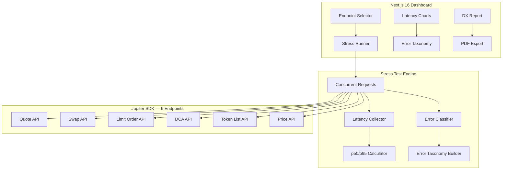

# Juprobe — Technical Architecture

## System Architecture



## Tech Stack

| Layer | Technology |
|---|---|
| **Frontend** | Next.js 16, React 19, Tailwind v4 |
| **Data** | Jupiter SDK (6 endpoints) |
| **Charts** | Recharts (latency, error rates) |
| **Report** | jsPDF (DX report) |
| **Database** | Supabase (benchmark history) |

## Jupiter API Integration Map

| Endpoint | Test Type | Concurrency | Depth |
|---|---|---|---|
| **Quote API** | Latency, rate limits, edge tokens | 10/50/100 | 🟢 Core |
| **Swap API** | Build tx, error handling, slippage | 5/10/25 | 🟢 Core |
| **Limit Order API** | Create/cancel, expiry edge cases | 5/10 | 🟢 Core |
| **DCA API** | Schedule creation, param validation | 5/10 | 🟢 Core |
| **Token List API** | Response size, caching behavior | 10/50 | 🟡 Supporting |
| **Price API** | Multi-token batch, staleness | 10/50/100 | 🟡 Supporting |

## API Routes

| Method | Path | Description |
|---|---|---|
| POST | `/api/probe/run` | Start stress test on selected endpoints |
| GET | `/api/probe/results/:id` | Get probe results (latency + errors) |
| GET | `/api/probe/history` | Previous benchmark runs |
| POST | `/api/report/generate` | Generate 2,000-word DX report |
| GET | `/api/report/:id/pdf` | Download PDF report |

## Database Schema

```sql
CREATE TABLE probe_runs (
    id UUID PRIMARY KEY DEFAULT gen_random_uuid(),
    endpoints_tested TEXT[] NOT NULL,
    concurrency_levels INT[] NOT NULL,
    status TEXT DEFAULT 'running',
    started_at TIMESTAMPTZ DEFAULT NOW(),
    completed_at TIMESTAMPTZ
);

CREATE TABLE probe_results (
    id UUID PRIMARY KEY DEFAULT gen_random_uuid(),
    run_id UUID REFERENCES probe_runs(id),
    endpoint TEXT NOT NULL,
    concurrency INT NOT NULL,
    p50_ms NUMERIC,
    p95_ms NUMERIC,
    error_rate NUMERIC,
    error_types JSONB,
    sample_size INT
);

CREATE TABLE dx_reports (
    id UUID PRIMARY KEY DEFAULT gen_random_uuid(),
    run_id UUID REFERENCES probe_runs(id),
    content TEXT NOT NULL,
    word_count INT,
    created_at TIMESTAMPTZ DEFAULT NOW()
);
```
