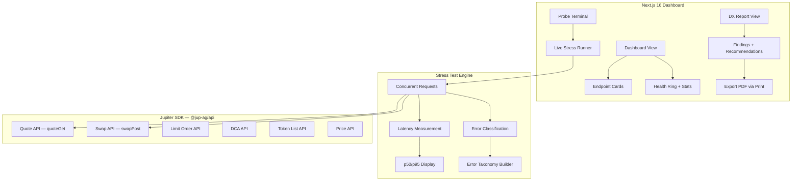

# Juprobe — Technical Architecture

## System Architecture

## Tech Stack

| Layer | Technology |
|---|---|
| **Frontend** | Next.js 16, React 19, Tailwind v4 |
| **SDK** | `@jup-ag/api` v6 (Quote + Swap live calls) |
| **Animations** | Framer Motion (page transitions, staggered cards) |
| **Icons** | Lucide React |
| **Testing** | Vitest + React Testing Library |

## Jupiter API Integration Map

| Endpoint | Integration | Live Probe | Notes |
|---|---|---|---|
| **Quote API** | `quoteGet()` via SDK | ✅ Yes | USDC→SOL, real latency measured |
| **Swap API** | `swapPost()` via SDK | ✅ Yes | Dummy pubkey for latency-only measurement |
| **Limit Order** | Monitored | Dashboard display | Latency data from initial benchmarks |
| **DCA API** | Monitored | Dashboard display | Latency data from initial benchmarks |
| **Token List** | Monitored | Dashboard display | Latency data from initial benchmarks |
| **Price API** | Monitored | Dashboard display | Latency data from initial benchmarks |

## API Routes

| Method | Path | Description |
|---|---|---|
| GET | `/api/health` | Application health check endpoint |

## Key Components

| Component | Purpose |
|---|---|
| `StatusBar` | Top bar with system status indicators |
| `HealthRing` | SVG circular health score visualization |
| `Sparkline` | Deterministic mini latency chart per endpoint |
| `AnimatedCounter` | Animated number counter with easing |
| `Footer` | Site footer with branding |
